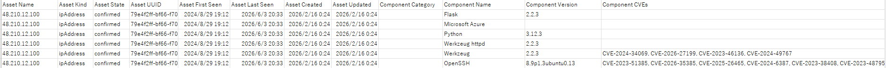
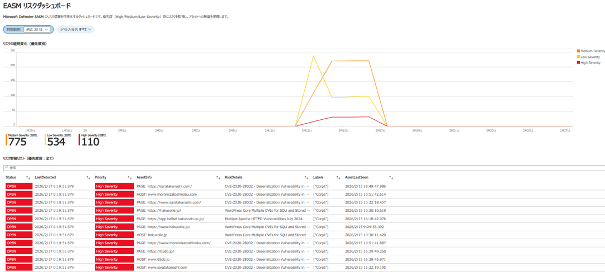

# Defender EASM Tools

Microsoft Defender External Attack Surface Management (Defender EASM) のデータを活用するためのツール集です。EASM が検出した外部公開資産（アセット）と脆弱性情報を、CSV エクスポートおよび Microsoft Sentinel / Azure Monitor ワークブックで可視化します。

## 構成

| ファイル | 種別 | 用途 |
|---------|------|------|
| [`Export_EASMVuln_CSV.ps1`](./Export_EASMVuln_CSV.ps1) | PowerShell | Defender EASM API からアセット・Web コンポーネント・CVE 情報を取得し CSV へエクスポート |
| [`EASM_historicalTrend_Workbook.json`](./EASM_historicalTrend_Workbook.json) | Azure Workbook | Log Analytics に取り込んだ EASM データのリスクを「経時変化（historical trend）」で可視化するワークブック |

---

## 1. Export_EASMVuln_CSV.ps1



Defender EASM では、アセット別の脆弱性情報を一覧化する仕組みがネイティブに備わってないが、API を活用することで、アセットデータをページネーション対応（デフォルトでは最大 20 ページ）で取得し、EASM で検出されたリソースと検出 CVE を含む CSV ファイルとして出力。

### 前提条件

- [Azure CLI](https://learn.microsoft.com/cli/azure/install-azure-cli) がインストール済みであること
- PowerShell 5.1 以降または PowerShell 7+
- Defender EASM ワークスペースに対する読み取り権限（例: `Reader`）を持つアカウント
- 対象サブスクリプションに Defender EASM リソース (`Microsoft.Easm/workspaces`) が存在すること

### 使い方

```powershell
# 対象テナント / サブスクリプションにサインイン
az login
az account set --subscription "<your-subscription-id>"

# スクリプトを実行（デフォルト: 最大 20 ページ取得）
./Export_EASMVuln_CSV.ps1

# 最大ページ数を変更する場合
./Export_EASMVuln_CSV.ps1 -MaxPages 50   # 最大 50 ページまで取得
./Export_EASMVuln_CSV.ps1 -MaxPages 0    # ページ上限なし（全件取得）
```

実行すると、カレントディレクトリに `EASM_Assets_<yyyyMMdd_HHmmss>.csv` が生成されます。

### パラメータ

| パラメータ | 既定値 | 説明 |
|-----------|-------|------|
| `-MaxPages` | `20` | 取得する最大ページ数。`0` を指定すると上限なし（全ページ取得）。1 ページあたり API の既定件数のアセットが返されます。 |

### 出力カラム

| カラム | 説明 |
|--------|------|
| Asset Name / Kind / State / UUID | アセットの基本情報 |
| Asset First/Last Seen, Created, Updated | 検出・更新日時 |
| Component Category / Name / Version | 検出された Web コンポーネント |
| Component CVEs | 紐づく CVE 番号（カンマ区切り） |
| Component First/Last Seen, Recent, Ports | コンポーネントの観測情報 |

### 認証について

アクセストークンは `az account get-access-token` で取得した一時トークンを利用します。**シークレットや API キーをスクリプトやファイルに保存しません。**

---

## 2. EASM_historicalTrend_Workbook.json



Microsoft 公式の [GitHub レポジトリ](https://github.com/Azure/MDEASM-Solutions/tree/main/Workbook) に公開されている Workbook では不足している、”経時的なリソース変化・経時的な脆弱性の状態の変化”という経時変化（historical trend）を可視化するためのソリューション。Defender EASM のデータコネクタ経由で Log Analytics に取り込まれた EASM カスタムテーブルを可視化。

### 前提条件

- Defender EASM のデータを Log Analytics ワークスペースへエクスポートしていること（`EasmRisk_CL`、`EasmAsset_CL`、`EasmLabel_CL` などのカスタムテーブルが存在すること）
- Microsoft Sentinel または Azure Monitor ワークブックの利用権限

### パラメータ

| パラメータ | 説明 |
|-----------|------|
| 時間範囲 (TimeRange) | 集計対象期間（既定 30 日。任意の期間を指定可能） |
| ラベルフィルタ (LabelFilter) | EASM ラベル単位でリスクを絞り込み（すべて / ラベルなし / 個別ラベル） |

### 可視化内容

| タイル | ビジュアライゼーション | 内容 |
|------|----------------|------|
| リスクの経時変化（優先度別） | 折れ線グラフ | High / Medium / Low Severity 別のリスク件数の推移 |
| リスク詳細リスト（優先度別） | テーブル | OPEN / Resolved 状態・アセット・検出日時を一覧表示 |
| 多くのリスクが紐づいているアセット Top 20 | 棒グラフ | 優先度別のリスク件数が多いアセット |

> 時刻表示は JST（UTC+9）で正規化されています。

### インポート手順

1. Azure Portal で **Microsoft Sentinel**（または **Azure Monitor** > **ブック**）を開く
2. **ブック** > **追加** > **詳細エディター**（`</>` アイコン）を開く
3. [`EASM_historicalTrend_Workbook.json`](./EASM_historicalTrend_Workbook.json) の内容を貼り付けて **適用**
4. ワークブックのリソースとして対象の **Log Analytics ワークスペース** を選択し、上部の **時間範囲**・**ラベルフィルタ** を調整

## 注意事項

- 本ツールは公式 Microsoft 製品ではなく、Defender EASM の API / データを利用するサンプルです。
- API バージョン (`2024-10-01-preview`) は Preview のため、将来変更される可能性があります。
- 出力される CSV やワークブックには組織の外部公開資産・脆弱性情報が含まれます。**取り扱いには十分注意してください。**

## ライセンス

 [MIT License](LICENSE)
